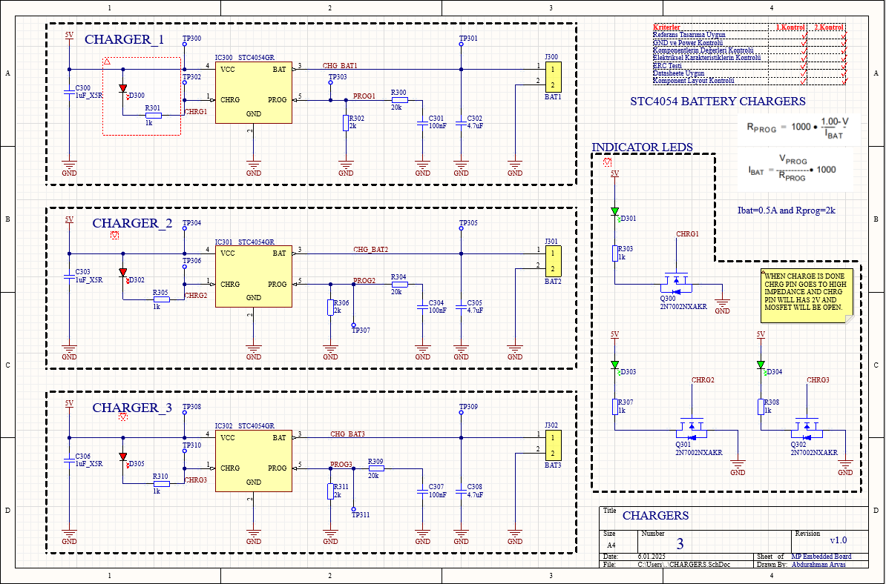
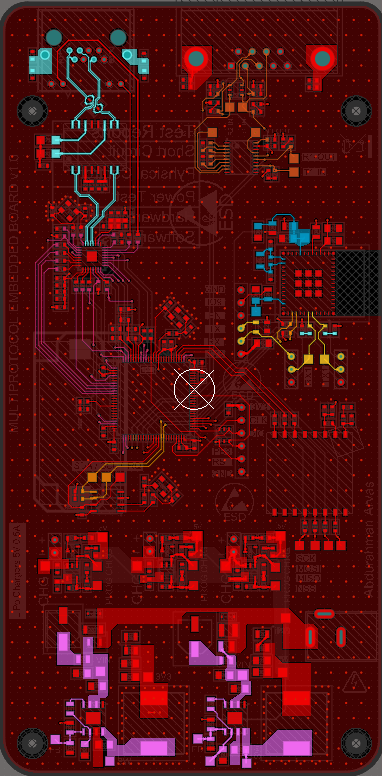

# Multi-Protocol Embedded Board (Portfolio Reference)

This is a custom STM32F4-based embedded system designed for multi-interface communication and smart power management.

The board includes:

- RS232 and Ethernet connectivity
- Wi-Fi and BLE via ESP32 module
- LoRa communication via RA-01S module
- Triple lithium battery charging circuits
- 24V/3A isolated power input

> ⚠️ **Note:**  
> This project was originally developed during my time at a now-closed R&D department.  
> It has not been commercialized and is shared here strictly for portfolio and reference purposes.  
> Due to commercial sensitivity, schematics, BOM, and firmware are **not shared publicly**.

---

## 🔧 Key Features

- STM32F4 MCU core
- ESP32 module for dual Wi-Fi/BLE communication
- LoRa RA-01S long-range wireless capability
- RS232 + Ethernet hardware interfaces
- 3x Li-ion battery charge support with protection circuitry
- Designed for 24V/3A industrial DC input

---

## 📎 Repository Status

- ❌ Schematics: Not shared
- ❌ Firmware: Not shared
- ❌ BOM: Not shared
- ✅ Feature documentation: Available
- ✅ Portfolio visibility: Public

---

## 🖼️ Visual References

### 🔹 Analog Charging Circuit

### 🔹 PCB Top Layer

### 🔹 PCB Bottom Layer

### 🔹 3D Render

> 📝 These visuals are shared for demonstration purposes only. The full design remains confidential.

## 📌 Disclaimer

This repository is published for reference purposes only.  
No commercial or licensed use of this design is authorized.

## 🧩 Partial Circuit Share

A simplified version of the analog front-end has been shared below as an example.  
It includes basic filtering, power regulation, and battery charge circuitry.

You can find the schematic PDF in the `Hardware/` folder.

> 📝 Only this analog section is publicly shared. The full design remains confidential.
